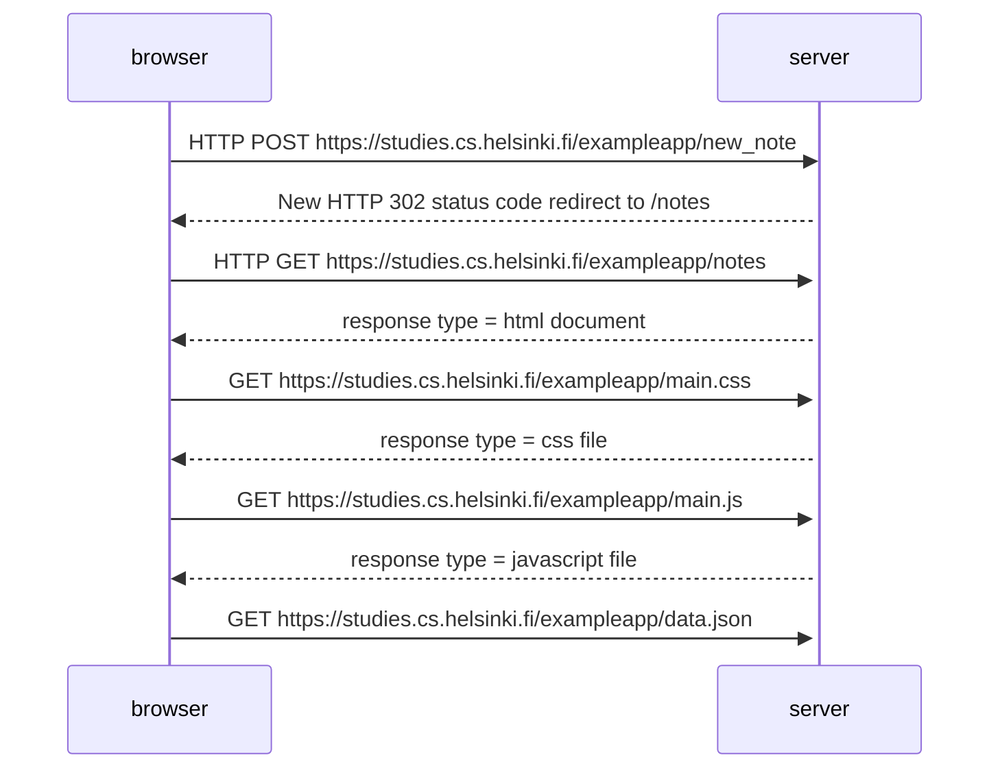

```mermaid
    sequenceDiagram
        participant browser
        participant server

        browser->>server: HTTP POST https://studies.cs.helsinki.fi/exampleapp/new_note
        activate server
        server-->>browser: New HTTP 302 status code redirect to /notes 

        browser->>server:HTTP GET https://studies.cs.helsinki.fi/exampleapp/notes
        activate server
        server-->>browser: response type = html document

        browser->>server: GET https://studies.cs.helsinki.fi/exampleapp/main.css
        activate server
        server-->>browser: response type = css file

        browser->>server: GET https://studies.cs.helsinki.fi/exampleapp/main.js
        activate server
        server-->>browser: response type = javascript file

        browser->>server: GET https://studies.cs.helsinki.fi/exampleapp/data.json
        activate server
```